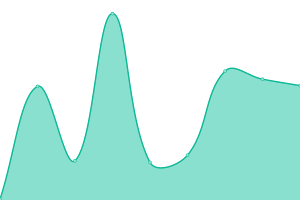
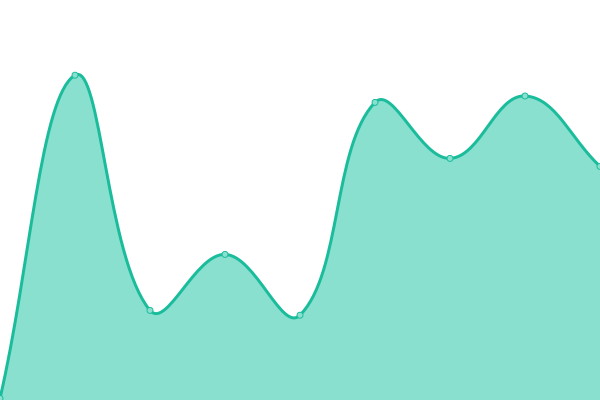
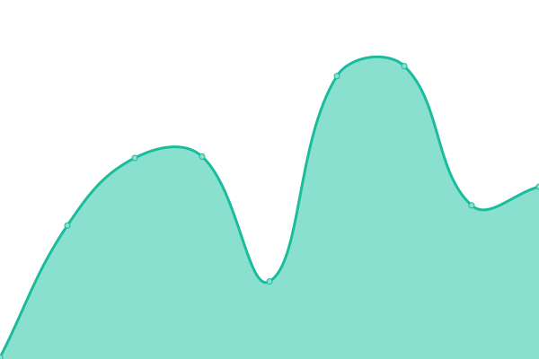
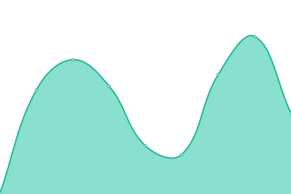
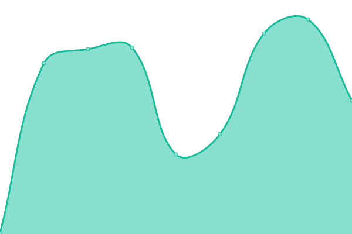

# [📈 Live Status](https://shadowdara.github.io/upptime): <!--live status--> **🟩 All systems operational**

This repository contains the open-source uptime monitor and status page for [shadowdara](shadowdara.github.io), powered by [Upptime](https://github.com/upptime/upptime).

With [Upptime](https://upptime.js.org), you can get your own unlimited and free uptime monitor and status page, powered entirely by a GitHub repository. We use [Issues](https://github.com/shadowdara/upptime/issues) as incident reports, [Actions](https://github.com/shadowdara/upptime/actions) as uptime monitors, and [Pages](https://shadowdara.github.io/upptime) for the status page.

<!--start: status pages-->
<!-- This summary is generated by Upptime (https://github.com/upptime/upptime) -->
<!-- Do not edit this manually, your changes will be overwritten -->
<!-- prettier-ignore -->
| URL | Status | History | Response Time | Uptime |
| --- | ------ | ------- | ------------- | ------ |
|  [Shadowdara - Vercel](https://shadowdara.vercel.app/) | 🟩 Up | [shadowdara-vercel.yml](https://github.com/ShadowDara/upptime/commits/HEAD/history/shadowdara-vercel.yml) | 

 173ms
     
 | 

<a href="https://shadowdara.github.io/upptime/history/shadowdara-vercel">100.00%</a>
    

|  [Minecrafttools](https://minecrafttools.vercel.app/) | 🟩 Up | [minecrafttools.yml](https://github.com/ShadowDara/upptime/commits/HEAD/history/minecrafttools.yml) | 

 101ms
     
 | 

<a href="https://shadowdara.github.io/upptime/history/minecrafttools">100.00%</a>
    

|  [Repo Database Creator - Vercel](https://repo-database-creator.vercel.app/) | 🟩 Up | [repo-database-creator-vercel.yml](https://github.com/ShadowDara/upptime/commits/HEAD/history/repo-database-creator-vercel.yml) | 

 115ms
     
 | 

<a href="https://shadowdara.github.io/upptime/history/repo-database-creator-vercel">100.00%</a>
    

|  [Shadowdara - Infinityfree](https://shadowdara.42web.io/) | 🟩 Up | [shadowdara-infinityfree.yml](https://github.com/ShadowDara/upptime/commits/HEAD/history/shadowdara-infinityfree.yml) | 

 716ms
     
 | 

<a href="https://shadowdara.github.io/upptime/history/shadowdara-infinityfree">84.72%</a>
    

|  [no fucking CORS - Vercel](https://no-fucking-cors.vercel.app/) | 🟩 Up | [no-fucking-cors-vercel.yml](https://github.com/ShadowDara/upptime/commits/HEAD/history/no-fucking-cors-vercel.yml) | 

 96ms
     
 | 

<a href="https://shadowdara.github.io/upptime/history/no-fucking-cors-vercel">0.00%</a>
    

|  [Watch Nexo Knights](https://watchnexoknights.vercel.app/) | 🟩 Up | [watch-nexo-knights.yml](https://github.com/ShadowDara/upptime/commits/HEAD/history/watch-nexo-knights.yml) | 

 163ms
     
 | 

<a href="https://shadowdara.github.io/upptime/history/watch-nexo-knights">100.00%</a>
    

|  [Zug fahren](https://zug-fahren.rf.gd/) | 🟩 Up | [zug-fahren.yml](https://github.com/ShadowDara/upptime/commits/HEAD/history/zug-fahren.yml) | 

 987ms
     
 | 

<a href="https://shadowdara.github.io/upptime/history/zug-fahren">85.78%</a>
    

|  [Zug fahren tmp](https://zug-fahren-tp.vercel.app/) | 🟩 Up | [zug-fahren-tmp.yml](https://github.com/ShadowDara/upptime/commits/HEAD/history/zug-fahren-tmp.yml) | 

 191ms
     
 | 

<a href="https://shadowdara.github.io/upptime/history/zug-fahren-tmp">100.00%</a>
    

<!--end: status pages-->

[**Visit our status website →**](https://shadowdara.github.io/upptime)

## 📄 License

- Powered by: [Upptime](https://github.com/upptime/upptime)
- Code: [MIT](./LICENSE) © [Anand Chowdhary](https://anandchowdhary.com), supported by [Pabio](https://pabio.com)
- Data in the `./history` directory: [Open Database License](https://opendatacommons.org/licenses/odbl/1-0/)
